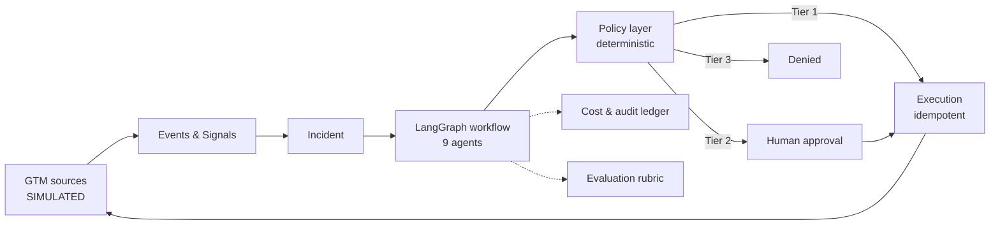

# Revenue Sentinel

**An Agentic AI GTM Control Tower** — detects revenue leakage and growth opportunities
across go-to-market systems, investigates each finding with specialized agents, quantifies
impact with deterministic code, recommends ranked interventions, enforces policy, obtains
human approval for sensitive actions, executes approved workflows idempotently, tracks
cost, and evaluates its own behaviour.

---

## ⚠️ Current status — read this first

> **Session 8 of 11 is complete: detect, investigate, decide, approve, execute, account
> for every cent — and evaluate itself. Offline and for free.**
>
> `make investigate INCIDENT=INC-001` produces a plan, six evidence items, two hypotheses
> each citing real evidence, **$108,000 weighted / $32,130 at risk**, and three ranked
> interventions carrying **one ALLOW, one REQUIRE_APPROVAL and one DENY** — with no API key
> and no network. Verified by **950 passing tests**.
>
> **The GTM MCP server is real.** 15 narrow, strictly-typed tools; no `run_sql`, no
> `http_request`. Two transports, both IMPLEMENTED: the in-process client the graph and
> tests use, and a spec-compliant **stdio server** (`make mcp`) driven by tests as a **real
> subprocess** — MCP handshake, JSON-RPC, `tools/list`, a successful read, typed
> `NOT_FOUND` and `INVALID_ARGUMENTS`, and `additionalProperties: false` verified as
> received over the wire. Both delegate to the same dispatcher, so they cannot drift.
>
> **Three things are SIMULATED and labelled as such.** The event source replays the locally
> seeded GTM mirror, not an external system. The LLM fixtures are **hand-authored, not
> recorded from a model** (ADR-0013) — they prove the pipeline and the schemas, not that
> the prompts work against a live model. And **every integration behind the MCP server is
> simulated**: each adapter declares `INTEGRATION_STATUS = "SIMULATED"`, every tool result
> carries it, and an adapter that fails to declare one raises rather than defaulting.
> **This system has never made an API call.**
>
> **The policy engine is real, and it says no.** Four tiers, default-deny for anything
> unclassified, escalation to the higher tier when rules disagree, and every decision
> recording the rules that produced it. It is a pure function — no I/O, no clock, and no
> access to model-written text (ADR-0015). The model may *propose* sending an email
> directly; the system refuses and records the refusal.
>
> **It executes — and only what was authorised.** `make demo` runs the whole scenario
> offline: a Tier 1 CRM task executes automatically, a Tier 2 email **draft** pauses for a
> person, and resuming after approval creates exactly one unsent draft. Re-running creates
> **zero** duplicate effects. Every result is stamped `SIMULATED`, and nothing is ever
> sent — there is no `messaging_send_email` tool and no send method on the messaging port.
>
> **Three things it does not claim.** Resume is *application-level over business tables*,
> not LangGraph durable interrupt/resume (ADR-0016). Execution is **at-least-once**, not
> exactly-once — an interrupted attempt is recorded `INDETERMINATE` and needs a human
> (ADR-0017). And approvals are **not authenticated**: `--as` is a claimed identity, there
> is no auth anywhere, and there is deliberately no HTTP approval endpoint (ADR-0018).
>
> **Budgets refuse before they are exceeded.** `BUDGET_EXCEEDED` fires before the model
> client is reached — proven by a counting fake that records zero calls, because "the call
> failed" and "the call never happened" are different facts. Every model and tool call
> gets a `cost_entry`, and `make demo` prints the total as **`$0.000000`**, unrounded,
> because fixture mode consumes zero tokens.
>
> **What that figure does not prove.** No live API call has ever been made, so the pricing
> arithmetic is exhaustively tested and the provider's token accounting is not. The
> pre-call estimator is admission control, never billing truth. And the global budget is
> not safe against two concurrent runs (ADR-0019).
>
> **It grades itself, deterministically.** `make eval` reports 15/15 workflow checks,
> 6/6 prompt-injection cases, and 5/5 policy-bypass checks — every one decided from
> persisted rows, with **no LLM judge** and a cost of `$0.000000`. Each of the 15 checks
> has a **negative test** proving it can fail, because a rubric nobody has seen fail is a
> rubric nobody knows works.
>
> **What that does not claim.** One golden scenario measures no production precision,
> recall, or intervention effectiveness, and nothing subjective is scored. "Contained" does
> not mean the model obeyed — it means the payload could not escape its block, could not
> authorise an action, and could not reach a capability that does not exist.
>
> What does not exist yet: **the dashboard.** See
> [`PROJECT_STATUS.md`](PROJECT_STATUS.md) for the precise state.
>
> **All integrations are SIMULATED by design.** No real HubSpot, Salesforce, Gmail, Slack,
> customer, or employer data is connected — now or during the initial build. Every
> capability is labelled IMPLEMENTED / SIMULATED / SCAFFOLDED / ROADMAP in
> [`CAPABILITY_MATRIX.md`](CAPABILITY_MATRIX.md), and those labels are enforced in code
> rather than asserted in prose.

---

## The problem

Revenue leaks quietly. A high-value opportunity goes cold while the buying committee is
actively evaluating the product. The data needed to catch it already exists — spread across
CRM, product analytics, engagement tooling, and support — and nobody correlates it in time.

**The first vertical slice** is the sharpest instance of that pattern:

> A high-value opportunity has had **no sales activity for 14 days**, while product usage
> from the account has **increased 40%**.

The buyer is engaged. The seller is absent. Nothing in the CRM changed, so nothing alerted.

---

## What makes this interesting

**Only four of the nine agents use a language model.**

| LLM-backed | Deterministic |
|---|---|
| Investigation Planner | Signal Agent |
| Research Agent (tool selection) | Policy & Risk Agent |
| Revenue Analyst — hypotheses | Revenue Analyst — **impact calculation** |
| Strategy Agent — drafting | Strategy Agent — **ranking** |
| | Execution Agent · Evaluation Agent · Cost Governor |

Money, policy, ranking, and budgets are tested Python. Models classify, plan, hypothesize,
and draft. This is enforced three ways — an `import-linter` rule that makes `analytics/`
unable to import `intelligence/`, an MCP tool boundary that lets the analyst *request* a
calculation it cannot perform, and an evaluation check that queries the model-call ledger
to prove no arithmetic node ever called a model.

Four more properties worth the click:

- **Every external action passes through a deterministic policy layer.** Prompt injection
  cannot escalate privilege, because privilege is not model-mediated. Sending email is not
  a capability the system has — it can only draft.
- **Idempotency is a database constraint**, not application logic. Re-running a workflow
  cannot send a second email.
- **Every dollar is accounted for** — per model call, per tool call, per incident, with
  budgets enforced *before* spend.
- **The demo runs fully offline**, with no API key, and produces byte-identical output
  every time.

---

## Architecture at a glance



Eight layers, each mapping to exactly one Python package, with boundaries checked in CI.
Full detail in [`docs/system-architecture.md`](docs/system-architecture.md).

**Stack:** Python 3.12 · FastAPI · Pydantic · SQLAlchemy · PostgreSQL 16 · Alembic ·
LangGraph · custom MCP server · Next.js · TypeScript · Docker Compose · Pytest · Ruff ·
Mypy · GitHub Actions · structured logging · OpenTelemetry-compatible tracing design.

---

## Documentation

**Start here**

| Document | What it covers |
|---|---|
| [`PROJECT_STATUS.md`](PROJECT_STATUS.md) | What actually works right now |
| [`CAPABILITY_MATRIX.md`](CAPABILITY_MATRIX.md) | Every capability with an honest status |
| [`docs/demo-scenario.md`](docs/demo-scenario.md) | The golden path, end to end |
| [`docs/system-architecture.md`](docs/system-architecture.md) | Layers, boundaries, deployment |

**Design**
[`product-requirements`](docs/product-requirements.md) ·
[`agent-architecture`](docs/agent-architecture.md) ·
[`data-model`](docs/data-model.md) ·
[`event-model`](docs/event-model.md) ·
[`mcp-design`](docs/mcp-design.md) ·
[`security-model`](docs/security-model.md) ·
[`cost-governance`](docs/cost-governance.md) ·
[`evaluation-strategy`](docs/evaluation-strategy.md) ·
[`scaling-roadmap`](docs/scaling-roadmap.md)

**Decisions and plan**
[`IMPLEMENTATION_PLAN.md`](IMPLEMENTATION_PLAN.md) ·
[`DECISIONS.md`](DECISIONS.md) ·
[`ADRs`](docs/architecture-decisions/) ·
[`ASSUMPTIONS.md`](ASSUMPTIONS.md) ·
[`RISKS.md`](RISKS.md)

---

## Running it

Verified from a clean database against the current commit:

```bash
cp .env.example .env    # then set POSTGRES_PASSWORD and match it in DATABASE_URL
make setup              # install dependencies (uv, Python 3.12.3)
make up                 # start PostgreSQL on host port 55432
make migrate            # 29 tables, 27 native enum types
make seed               # 92 deterministic rows, all is_simulated = true
make ingest             # detect signals and open incidents (SIMULATED source feed)
make investigate        # run the investigation graph offline (INCIDENT=INC-001)
make check              # lint, format, mypy --strict, boundaries, 950 tests
make api                # then: curl localhost:8000/incidents/INC-001
make mcp                # the GTM MCP server over stdio (SIMULATED adapters)
make demo               # the whole scenario end to end — offline, $0, resets local data
make approvals          # list pending approvals
uv run rs cost INC-001 --timeline   # cost ledger and trace-correlated timeline
make eval               # deterministic self-evaluation — $0, no model consulted

```

Confirm the golden scenario landed:

```bash
docker compose exec postgres psql -U sentinel -d revenue_sentinel \
  -c "SELECT opportunity_ref, amount, stage, probability FROM opportunities
      WHERE opportunity_ref = 'OPP-2001';"
```

**Not yet functional** — these `Makefile` targets are declared and become real later:
`make eval` (Session 8), `make web` (9). `make record` works but makes
billable API calls and **has never been run**.

**Prerequisites:** [`uv`](https://docs.astral.sh/uv/), Docker with Compose, and Node 22+
with pnpm (Session 9 only). `uv` installs Python 3.12.3 itself, so a system Python of the
right version is not required.

PostgreSQL binds host port **55432** deliberately, to avoid colliding with a local
PostgreSQL on 5432. Do not "fix" this to 5432 — it would silently connect the application
to the wrong database.

---

## What this is not

- Not connected to any real system, and not claimed to be
- Not yet an agentic system at all — Session 1 built the foundations underneath one
- Not multi-tenant, and has no authentication
- Not able to send email — only to draft it, behind human approval
- Not deployed anywhere
- Not measuring recommendation quality or intervention effectiveness — that needs outcome
  data this project does not have, and reporting a number without it would be fabrication

Full list in [`docs/product-requirements.md`](docs/product-requirements.md) §7 and
[`docs/scaling-roadmap.md`](docs/scaling-roadmap.md).

---

## Development rules

This repository follows twenty standing rules recorded in [`CLAUDE.md`](CLAUDE.md) — plan
before implementing, one complete vertical slice before expanding, typed interfaces and
structured outputs, deterministic calculation outside the LLM, all external actions through
policy, human approval for customer-facing communication, never claim mocked integrations
are real, never bypass a failing test.

---

**Author:** Mahima Advilkar
