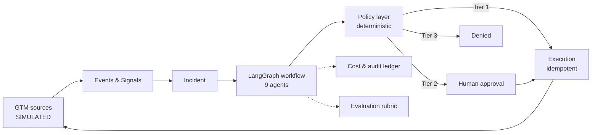

# Revenue Sentinel

**An Agentic AI GTM Control Tower** — detects revenue leakage and growth opportunities
across go-to-market systems, investigates each finding with specialized agents, quantifies
impact with deterministic code, recommends ranked interventions, enforces policy, obtains
human approval for sensitive actions, executes approved workflows idempotently, tracks
cost, and evaluates its own behaviour.

---

## ⚠️ Current status — read this first

> **Session 2 of 11 is complete: detection runs, investigation does not.**
>
> What works today: the full detection pipeline — ingestion, normalization, a pure
> `stalled_opportunity` detector, incident creation, the lifecycle state machine, and four
> HTTP endpoints. `make ingest` opens `INC-001`; running it again creates nothing.
> Verified by 432 passing tests.
>
> **The event source is SIMULATED** — it replays the locally seeded GTM mirror, not an
> external system, and says so on every response.
>
> What does not exist yet: **any agent node, any LLM call, the MCP server, the policy
> engine, execution, and the dashboard.** This system has never called a model. `make demo`
> does not work. See [`PROJECT_STATUS.md`](PROJECT_STATUS.md) for the precise state.
>
> **All integrations are SIMULATED by design.** No real HubSpot, Salesforce, Gmail, Slack,
> customer, or employer data is connected — now or during the initial build. Every
> capability is labelled IMPLEMENTED / SIMULATED / SCAFFOLDED / ROADMAP in
> [`CAPABILITY_MATRIX.md`](CAPABILITY_MATRIX.md), and those labels are enforced in code
> rather than asserted in prose.

---

## The problem

Revenue leaks quietly. A high-value opportunity goes cold while the buying committee is
actively evaluating the product. The data needed to catch it already exists — spread across
CRM, product analytics, engagement tooling, and support — and nobody correlates it in time.

**The first vertical slice** is the sharpest instance of that pattern:

> A high-value opportunity has had **no sales activity for 14 days**, while product usage
> from the account has **increased 40%**.

The buyer is engaged. The seller is absent. Nothing in the CRM changed, so nothing alerted.

---

## What makes this interesting

**Only four of the nine agents use a language model.**

| LLM-backed | Deterministic |
|---|---|
| Investigation Planner | Signal Agent |
| Research Agent (tool selection) | Policy & Risk Agent |
| Revenue Analyst — hypotheses | Revenue Analyst — **impact calculation** |
| Strategy Agent — drafting | Strategy Agent — **ranking** |
| | Execution Agent · Evaluation Agent · Cost Governor |

Money, policy, ranking, and budgets are tested Python. Models classify, plan, hypothesize,
and draft. This is enforced three ways — an `import-linter` rule that makes `analytics/`
unable to import `intelligence/`, an MCP tool boundary that lets the analyst *request* a
calculation it cannot perform, and an evaluation check that queries the model-call ledger
to prove no arithmetic node ever called a model.

Four more properties worth the click:

- **Every external action passes through a deterministic policy layer.** Prompt injection
  cannot escalate privilege, because privilege is not model-mediated. Sending email is not
  a capability the system has — it can only draft.
- **Idempotency is a database constraint**, not application logic. Re-running a workflow
  cannot send a second email.
- **Every dollar is accounted for** — per model call, per tool call, per incident, with
  budgets enforced *before* spend.
- **The demo runs fully offline**, with no API key, and produces byte-identical output
  every time.

---

## Architecture at a glance



Eight layers, each mapping to exactly one Python package, with boundaries checked in CI.
Full detail in [`docs/system-architecture.md`](docs/system-architecture.md).

**Stack:** Python 3.12 · FastAPI · Pydantic · SQLAlchemy · PostgreSQL 16 · Alembic ·
LangGraph · custom MCP server · Next.js · TypeScript · Docker Compose · Pytest · Ruff ·
Mypy · GitHub Actions · structured logging · OpenTelemetry-compatible tracing design.

---

## Documentation

**Start here**

| Document | What it covers |
|---|---|
| [`PROJECT_STATUS.md`](PROJECT_STATUS.md) | What actually works right now |
| [`CAPABILITY_MATRIX.md`](CAPABILITY_MATRIX.md) | Every capability with an honest status |
| [`docs/demo-scenario.md`](docs/demo-scenario.md) | The golden path, end to end |
| [`docs/system-architecture.md`](docs/system-architecture.md) | Layers, boundaries, deployment |

**Design**
[`product-requirements`](docs/product-requirements.md) ·
[`agent-architecture`](docs/agent-architecture.md) ·
[`data-model`](docs/data-model.md) ·
[`event-model`](docs/event-model.md) ·
[`mcp-design`](docs/mcp-design.md) ·
[`security-model`](docs/security-model.md) ·
[`cost-governance`](docs/cost-governance.md) ·
[`evaluation-strategy`](docs/evaluation-strategy.md) ·
[`scaling-roadmap`](docs/scaling-roadmap.md)

**Decisions and plan**
[`IMPLEMENTATION_PLAN.md`](IMPLEMENTATION_PLAN.md) ·
[`DECISIONS.md`](DECISIONS.md) ·
[`ADRs`](docs/architecture-decisions/) ·
[`ASSUMPTIONS.md`](ASSUMPTIONS.md) ·
[`RISKS.md`](RISKS.md)

---

## Running it

Verified from a clean database against the current commit:

```bash
cp .env.example .env    # then set POSTGRES_PASSWORD and match it in DATABASE_URL
make setup              # install dependencies (uv, Python 3.12.3)
make up                 # start PostgreSQL on host port 55432
make migrate            # 29 tables, 26 native enum types
make seed               # 92 deterministic rows, all is_simulated = true
make ingest             # detect signals and open incidents (SIMULATED source feed)
make check              # lint, format, mypy --strict, boundaries, 432 tests
make api                # then: curl localhost:8000/incidents/INC-001
```

Confirm the golden scenario landed:

```bash
docker compose exec postgres psql -U sentinel -d revenue_sentinel \
  -c "SELECT opportunity_ref, amount, stage, probability FROM opportunities
      WHERE opportunity_ref = 'OPP-2001';"
```

**Not yet functional** — these `Makefile` targets are declared and become real later:
`make mcp` (Session 4), `make demo` (6), `make eval` (8), `make web` (9).

**Prerequisites:** [`uv`](https://docs.astral.sh/uv/), Docker with Compose, and Node 22+
with pnpm (Session 9 only). `uv` installs Python 3.12.3 itself, so a system Python of the
right version is not required.

PostgreSQL binds host port **55432** deliberately, to avoid colliding with a local
PostgreSQL on 5432. Do not "fix" this to 5432 — it would silently connect the application
to the wrong database.

---

## What this is not

- Not connected to any real system, and not claimed to be
- Not yet an agentic system at all — Session 1 built the foundations underneath one
- Not multi-tenant, and has no authentication
- Not able to send email — only to draft it, behind human approval
- Not deployed anywhere
- Not measuring recommendation quality or intervention effectiveness — that needs outcome
  data this project does not have, and reporting a number without it would be fabrication

Full list in [`docs/product-requirements.md`](docs/product-requirements.md) §7 and
[`docs/scaling-roadmap.md`](docs/scaling-roadmap.md).

---

## Development rules

This repository follows twenty standing rules recorded in [`CLAUDE.md`](CLAUDE.md) — plan
before implementing, one complete vertical slice before expanding, typed interfaces and
structured outputs, deterministic calculation outside the LLM, all external actions through
policy, human approval for customer-facing communication, never claim mocked integrations
are real, never bypass a failing test.

---

**Author:** Mahima Advilkar
