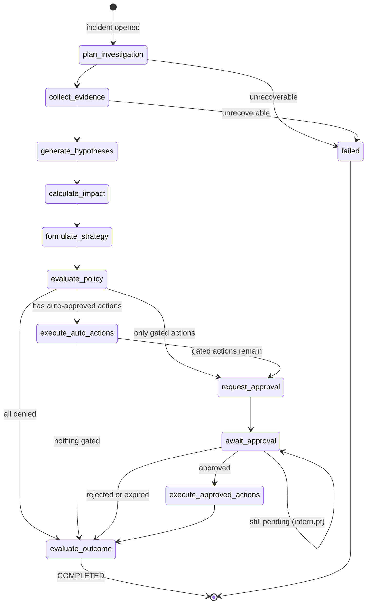

# Agent Architecture

**Status:** AUTHORITATIVE
**Last updated:** 2026-08-01 (Phase 1)

Revenue Sentinel uses an **explicit graph / state machine**, implemented with LangGraph.
There is no group chat, no autonomous agent-to-agent negotiation, and no emergent
control flow. Every transition is declared, typed, and persisted.

---

## 1. The central design claim

**Only four of the nine logical agents are LLM-backed.**

Rules 4 and 9 in [`../CLAUDE.md`](../CLAUDE.md) — typed structured outputs, and
deterministic calculation outside the LLM — force this split. It is the most important
thing to understand about this system.

| # | Agent | Implementation | Uses LLM? | Rationale |
|---|---|---|---|---|
| 1 | **Signal Agent** | Deterministic rule detectors | No | Detection must be reproducible and unit-testable. A threshold is a threshold. |
| 2 | **Investigation Planner** | LLM → structured `InvestigationPlan` | **Yes** | Genuine reasoning over ambiguous, incomplete context. |
| 3 | **Research Agent** | LLM selects tools; MCP returns fixed data | **Yes** | The LLM chooses *which* evidence to gather; retrieval itself is deterministic. |
| 4 | **Revenue Analyst** | Hybrid — hypotheses LLM, arithmetic deterministic | **Partly** | Money math never passes through a model. |
| 5 | **Strategy Agent** | LLM drafts, deterministic scorer ranks | **Partly** | Ranking is a tested formula, not a judgement call. |
| 6 | **Policy & Risk Agent** | Deterministic rule engine | No | A policy layer you cannot prove is not a policy layer. |
| 7 | **Execution Agent** | Deterministic executor | No | Side effects must be idempotent and replayable. |
| 8 | **Evaluation Agent** | Deterministic rubric (LLM judge = ROADMAP) | No | A grader that drifts cannot detect regressions. |
| 9 | **Cost Governor** | Deterministic budget arithmetic | No | It is arithmetic. Rule 9 applies to the system's own accounting too. |

Two of the nine are **not graph nodes**:

- **Signal Agent** runs *upstream* of the graph, in the event pipeline. It creates the
  incident that starts a workflow run.
- **Cost Governor** runs *around* the graph, as a pre-call guard on every LLM and tool
  invocation, plus a budget check at graph entry.

---

## 2. The orchestration graph



### Node contract

Every node has the same shape. This is what makes the graph testable without LangGraph
running at all:

```
Node: (WorkflowState) -> StateDelta
Edge: (WorkflowState) -> bool          # pure predicate, no I/O
```

Nodes are **thin**. Per ADR-0002, a node's body does three things: read typed fields off
the state, call exactly one service in `agents/` or `analytics/` or `governance/`, and
return a typed delta. Domain logic, policy rules, calculations, persistence, adapters,
and audit logging all live outside the node.

### Node reference

**Implementation status (Session 3):** the first four nodes are built and the graph ends
after `calculate_impact`. Everything from `formulate_strategy` onward is Sessions 5-6.

| Node | Agent | LLM | Reads from state | Writes to state | Built |
|---|---|---|---|---|---|
| `plan_investigation` | Investigation Planner | Yes | `incident` | `plan` | **S3** |
| `collect_evidence` | Research Agent | Yes (source choice) | `plan` | `evidence[]` | **S3** |
| `generate_hypotheses` | Revenue Analyst | Yes | `evidence[]` | `hypotheses[]` | **S3** |
| `calculate_impact` | Revenue Analyst | **No** | `incident`, `evidence[]` | `impact` | **S3** |
| `formulate_strategy` | Strategy Agent | Yes (draft only) | `hypotheses[]`, `impact` | `interventions[]` (ranked) |
| `evaluate_policy` | Policy & Risk | **No** | `interventions[]` | `policy_decisions[]` |
| `execute_auto_actions` | Execution | **No** | `policy_decisions[]` | `actions[]` |
| `request_approval` | Execution | **No** | `policy_decisions[]` | `approval_requests[]` |
| `await_approval` | — (interrupt) | **No** | `approval_requests[]` | — |
| `execute_approved_actions` | Execution | **No** | `approval_requests[]` | `actions[]` |
| `evaluate_outcome` | Evaluation | **No** | entire state | `evaluation_result` |

`calculate_impact` runs after `generate_hypotheses` rather than in parallel, purely to
keep the v1 graph linear and the demo timeline readable. Parallelising it is a ROADMAP item.

---

## 3. Workflow state

`WorkflowState` is a Pydantic model in `domain/`. Every field is explicitly typed; no
`dict[str, Any]` anywhere.

| Field | Type | Set by |
|---|---|---|
| `run_id`, `incident_id` | `UUID` | runtime |
| `incident` | `Incident` | incident service |
| `plan` | `InvestigationPlan \| None` | `plan_investigation` |
| `evidence` | `list[EvidenceItem]` | `collect_evidence` |
| `hypotheses` | `list[Hypothesis]` | `generate_hypotheses` |
| `impact` | `ImpactAssessment \| None` | `calculate_impact` |
| `interventions` | `list[Intervention]` | `formulate_strategy` |
| `policy_decisions` | `list[PolicyDecision]` | `evaluate_policy` |
| `approval_requests` | `list[ApprovalRequest]` | `request_approval` |
| `actions` | `list[ActionRecord]` | execution nodes |
| `evaluation_result` | `EvaluationResult \| None` | `evaluate_outcome` |
| `cost_snapshot` | `CostSnapshot` | Cost Governor |

**Our tables are the source of truth**, not LangGraph's checkpointer. Every node
transition is written to `workflow_transitions` before the next node runs. LangGraph's
checkpointing is used for execution resume only — see ADR-0002.

**As built in Session 3**, `WorkflowState` carries only the fields the four implemented
nodes write: `plan`, `evidence`, `hypotheses`, `impact`, plus run identity and the injected
`evaluated_at`. Fields for `interventions`, `policy_decisions`, `actions`, and
`evaluation_result` are deliberately **absent until the nodes that write them exist** — a
typed field nothing writes is a claim the graph does something it does not.

The checkpointer is `InMemorySaver` (ADR-0012). Session 3 has no interrupt, and the durable
record is `workflow_transitions` either way; the Postgres saver arrives in Session 6.

Transition recording, model-call and agent-decision persistence all happen in a wrapper in
`orchestration/graph.py`, never in a node body. A test asserts that `nodes.py` imports no
persistence and that no node body exceeds six statements -- a fat node is the leading
indicator of the framework absorption ADR-0002 exists to prevent.

---

## 4. Human-in-the-loop

`await_approval` is a LangGraph **interrupt**. The graph halts; the run's status becomes
`AWAITING_APPROVAL`; the process is free to exit. When a human approves through the
dashboard, the API records the decision and resumes the run from its checkpoint.

This means an approval can arrive minutes or days later, across a process restart,
without the workflow losing a single piece of state. See
[`security-model.md`](security-model.md) for the approval flow diagram and the tier rules.

---

## 5. Structured outputs

Every LLM-backed node validates against a schema. There is no free-text parsing, no
regex over model output, and no `json.loads` on an unvalidated string.

| Node | Output model | Key validated invariants |
|---|---|---|
| `plan_investigation` | `InvestigationPlan` | 1–6 steps; every step names a permitted MCP tool |
| `collect_evidence` | `EvidenceSelection` | Every source is in the closed vocabulary **and** was named in the plan |
| `generate_hypotheses` | `HypothesisSet` | ≥2 hypotheses; each cites ≥1 `evidence_id` that exists in state |
| `formulate_strategy` | `InterventionSet` | Exactly 3 interventions; each has a declared `action_type` |

The "cites an evidence_id that exists in state" check is the anti-hallucination gate: a
hypothesis that references invented evidence fails validation and is rejected, not shown.

It cannot be a schema rule -- a schema has no way to know which evidence ids are in state --
so it runs in `agents/citations.py` **before persistence**, and the whole run aborts. There
is a second, structural layer beneath it: `hypothesis_evidence` has foreign keys to both
sides, so a fabricated reference has no row to point at even if the first check were
bypassed.

In Session 3 evidence is gathered through the `EvidenceSource` port backed by repositories.
Session 4 replaces that implementation with MCP-backed tools; the port's method names are
already the tool names, so the agents do not change.

---

## 6. Prompt construction and untrusted content

All CRM, email, website, and support content is **untrusted** (rule 14). It is never
concatenated into a system prompt. It is passed as clearly delimited, labelled data:

```
<evidence id="EV-003" source="crm" trust="untrusted">
  ...record content...
</evidence>
```

The system prompt states that content inside `<evidence>` is data to analyse and never
instructions to follow. Instruction-shaped text found inside evidence cannot authorise an
action, because **no LLM output reaches an external system without passing through the
deterministic policy layer** (rule 7). Injection defence is architectural, not just
prompt-level. See [`security-model.md`](security-model.md).

---

## 7. Agent responsibilities in detail

### Signal Agent — deterministic, upstream
Runs registered detectors against normalized events. v1 registers exactly one:
`stalled_opportunity`. Other detectors exist as contracts with no implementation. Emits a
`Signal`, which the incident service converts to an `Incident`.

### Investigation Planner — LLM
Given an incident, produces an ordered plan naming which evidence to gather and why.
Constrained to the tools the incident type permits.

### Research Agent — LLM-directed, deterministic retrieval
Executes the plan by calling GTM MCP tools. The LLM decides which tool and which
arguments; the tool returns fixture-backed data. Each result becomes an `EvidenceItem`
with a stable `evidence_id` and a `source` label.

### Revenue Analyst — hybrid
Two distinct responsibilities, deliberately split:
- **Hypotheses (LLM):** evidence-backed explanations, each citing evidence IDs.
- **Impact (deterministic, `analytics/`):** pipeline impact in dollars, computed in tested
  Python. See [`cost-governance.md`](cost-governance.md) for why this boundary is absolute.

### Strategy Agent — LLM draft, deterministic rank
Generates candidate interventions, then a tested scoring function ranks them on expected
value, effort, and risk. The model proposes; the code decides the order.

### Policy & Risk Agent — deterministic
Classifies each intervention into a risk tier and returns `ALLOW`, `REQUIRE_APPROVAL`, or
`DENY` with a recorded reason. Pure function of `(intervention, policy_rules)` — fully
unit-testable with no I/O.

### Execution Agent — deterministic
Executes only what carries an `ALLOW` decision or an approved `ApprovalRequest`. Every
action derives a deterministic `idempotency_key`; a duplicate key returns the original
`ActionRecord` instead of acting twice.

### Evaluation Agent — deterministic
Runs a rubric over the completed run: did policy hold, was arithmetic deterministic, was
approval obtained before external communication, were duplicates prevented, did every
hypothesis cite real evidence. Emits `EvaluationResult`. An LLM judge is ROADMAP.

### Cost Governor — deterministic
Checks budget before every model and tool call, selects the model tier for the call site,
records actual spend, and halts the run if a hard ceiling is reached. See
[`cost-governance.md`](cost-governance.md).

---

## Related documents

- [`system-architecture.md`](system-architecture.md) · [`mcp-design.md`](mcp-design.md) · [`security-model.md`](security-model.md) · [`evaluation-strategy.md`](evaluation-strategy.md)
- ADR [`0002`](architecture-decisions/0002-langgraph-orchestration-boundary.md), [`0003`](architecture-decisions/0003-deterministic-vs-llm-boundary.md)
