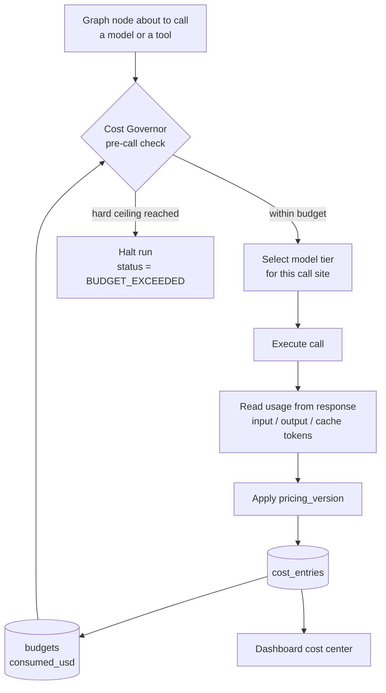

# Cost Governance

**Status:** AUTHORITATIVE
**Last updated:** 2026-08-01 (Phase 1)

An agentic system that cannot answer "what did that incident cost?" is not production
software. The **Cost Governor** answers it per run, per incident, and per period — and
enforces ceilings before spend happens, not after.

The Cost Governor is **deterministic**. Budget arithmetic is arithmetic; rule 9 applies to
the system's own accounting as much as to pipeline impact.

---

> **Session 7 status.** Everything below §1–§8 is now IMPLEMENTED, with three honest
> exceptions stated where they belong: **no live API usage has ever been observed**, the
> pre-call estimator is **admission control and never billing truth**, and the `GLOBAL`
> budget is **not safe against concurrent independent runs**. Every recorded figure is
> `$0.000000` because fixture mode consumes zero tokens — a true figure, not a rounding.
>
> Enforcement order (ADR-0019): `route → call ceilings → input estimate → worst-case
> reservation → **BUDGET_EXCEEDED here** → model call → actual usage → cost entry →
> consumed_usd`. Reservations are never persisted and never charged; only actual provider
> usage becomes spend.
>
> Prices are versioned data (ADR-0020): every `cost_entries` row stamps its
> `pricing_version`, and a published version is never edited in place.
>
> **Migration 0007.** `cost_entries.amount_usd` already held six decimals, but
> `budgets.limit_usd` and `consumed_usd` held two — so a limit finer than a cent could not
> be expressed and sub-cent spend vanished from budget accounting. Both are now
> `NUMERIC(12, 6)`; the downgrade refuses lossy truncation rather than corrupting recorded
> spend.

## 1. Cost flow

The loop from `BUDGET` back to `CHECK` is the point: the ceiling is evaluated against
actual recorded spend, so a runaway loop stops at the budget rather than at the invoice.

---

## 2. Budget scopes

| Scope | Default limit | Behaviour at limit |
|---|---|---|
| `RUN` | $0.50 per workflow run | Hard stop — run halts with `BUDGET_EXCEEDED` |
| `INCIDENT` | $2.00 across all runs for one incident | Hard stop — no further runs start |
| `GLOBAL` | $25.00 per calendar month | Hard stop — no new runs start |

Defaults are set in `.env.example` and are deliberately low. A demo that can accidentally
spend $200 is a demo with a design flaw.

Budgets are checked **before** each model call, using the estimated cost of the call (via
`count_tokens` on the prompt plus a configured output allowance). A call projected to
breach a hard ceiling is refused, not attempted.

---

## 3. Model routing

Model IDs and prices verified 2026-08-01 against the Anthropic model catalog.

| Model | ID | Context | Input $/MTok | Output $/MTok |
|---|---|---|---|---|
| Claude Opus 5 | `claude-opus-5` | 1M | $5.00 | $25.00 |
| Claude Sonnet 5 | `claude-sonnet-5` | 1M | $3.00 (intro $2.00 through 2026-08-31) | $15.00 (intro $10.00) |
| Claude Haiku 4.5 | `claude-haiku-4-5` | 200K | $1.00 | $5.00 |

**Default model: `claude-opus-5`.** Routing to a cheaper tier is an explicit,
per-call-site decision recorded in config — never an automatic downgrade.

### Routing table

| Call site | Model | Effort | Rationale |
|---|---|---|---|
| `plan_investigation` | `claude-opus-5` | `high` | Genuine multi-step reasoning over ambiguous context |
| `collect_evidence` (tool selection) | `claude-opus-5` | `medium` | Bounded choice from a small allowlist |
| `generate_hypotheses` | `claude-opus-5` | `high` | The output a human actually reads and judges |
| `formulate_strategy` | `claude-opus-5` | `high` | Drives the recommendation shown to the user |
| Classification / extraction utilities | `claude-haiku-4-5` | — | Short, mechanical, high volume |

Routing config lives in `intelligence/routing.py` with the pricing table versioned as
`pricing_version`. Every `cost_entries` row records the `pricing_version` used, so a price
change does not retroactively rewrite historical cost.

### Effort

`output_config: {"effort": ...}` with `thinking: {"type": "adaptive"}` is the primary
cost/quality lever. `high` is the default; `low` and `medium` are used where evals show
quality holds. Effort is set per call site, not globally.

---

## 4. Prompt caching

Caching is the single largest lever available, because every node in a run shares a large
stable prefix (system prompt, tool definitions, incident context).

| Mechanic | Value |
|---|---|
| Cache read | ~0.1× base input price |
| Cache write | 1.25× base (5-minute TTL), 2× base (1-hour TTL) |
| Break-even | 2 requests at 5-minute TTL; 3 at 1-hour TTL |
| Minimum cacheable prefix | 512 tokens on `claude-opus-5`; 1024 on `claude-sonnet-5`; 4096 on `claude-haiku-4-5` |

Design rules that follow from caching being a **prefix match**:

1. The system prompt is **frozen** — no timestamps, no run IDs, no per-incident
   interpolation. Dynamic context goes into messages, after the breakpoint.
2. Tool definitions are serialized deterministically (sorted by name). A reordered tool
   list invalidates the entire prefix.
3. The `cache_control` breakpoint sits on the last stable block — tools plus system.
4. `cache_read_input_tokens` is asserted non-zero in an integration test after the second
   call of a run. A silent cache regression is a cost regression, so it is a test failure.

`model_calls` records `cache_read_tokens` and `cache_write_tokens` separately, and the
dashboard shows the cache hit rate per run.

---

## 5. Structured output and cost

Every LLM call uses structured output — either `output_config.format` with a JSON schema,
or strict tool use (`strict: true`). This is primarily a correctness decision (rule 4), but
it is also a cost decision: a schema-constrained response cannot ramble, and a validation
failure that forces a retry is a doubled bill. Schemas are compiled once and cached for 24
hours by the API, so the compile cost is paid once per schema, not once per call.

---

## 6. The ledger

Three tables give a complete, queryable account of every run.

| Table | Records |
|---|---|
| `model_calls` | model ID, effort, input/output/cache tokens, latency, stop reason, trace and span IDs |
| `tool_calls` | tool name, arguments, result digest, status, duration, trace and span IDs |
| `cost_entries` | `amount_usd` NUMERIC(12,6), `pricing_version`, linked to the model or tool call that incurred it |

Every row carries `run_id` and `incident_id`. The cost of an incident is one `SUM`.

`amount_usd` is `NUMERIC(12,6)` — six decimal places, because a single Haiku call can cost
less than a hundredth of a cent and rounding those to zero makes the ledger lie.

---

## 7. Cost per incident — design target

The golden scenario budget, for the fixture-backed offline path and the live path:

| Path | Model calls | Target cost |
|---|---|---|
| Fixture mode (default demo) | 0 | **$0.00** |
| Live mode, cold cache | 4 | < $0.15 |
| Live mode, warm cache | 4 | < $0.05 |

The offline demo costing exactly zero is deliberate: the interview demo must never depend
on a budget, a network, or a rate limit (ADR-0007).

---

## 8. Cost is not the only meter

The Cost Governor also enforces non-monetary ceilings, because the cheapest failure mode
is a loop that never bills much but never terminates either:

| Limit | Default | Enforced at |
|---|---|---|
| Max model calls per run | 12 | Pre-call check |
| Max tool calls per run | 30 | Pre-call check |
| Max node executions per run | 40 | Graph runtime |
| Max wall-clock per run | 5 minutes | Graph runtime |

Any breach halts the run, records an audit event, and marks the incident `FAILED` with the
specific limit named — never a generic timeout.

---

## 9. Dashboard cost center (Day 10)

| View | Content |
|---|---|
| Period summary | Spend this month vs `GLOBAL` budget, with headroom |
| Per-incident | Cost, model calls, tool calls, cache hit rate |
| Per-run timeline | Every model and tool call in sequence with individual cost |
| Model mix | Spend by model ID and by effort level |
| Cache effectiveness | Read vs write tokens, estimated savings |

---

## Related documents

- [`agent-architecture.md`](agent-architecture.md) · [`data-model.md`](data-model.md) · [`system-architecture.md`](system-architecture.md) · [`evaluation-strategy.md`](evaluation-strategy.md)
- ADR [`0003`](architecture-decisions/0003-deterministic-vs-llm-boundary.md), [`0007`](architecture-decisions/0007-offline-fixture-demo-mode.md)
