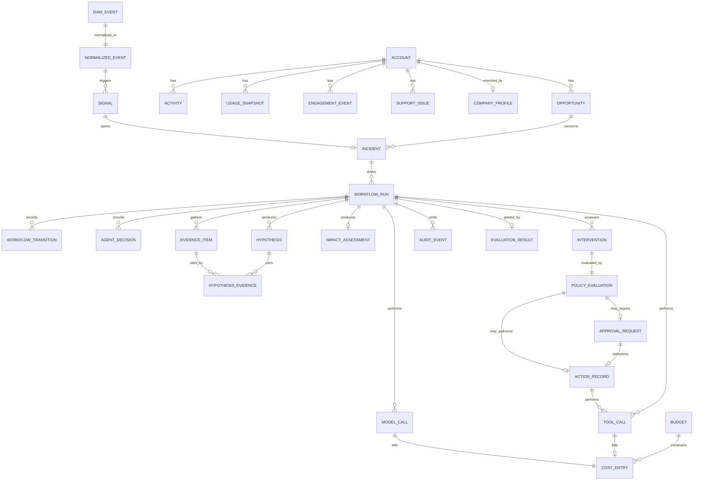

# Data Model

**Status:** AUTHORITATIVE
**Last updated:** 2026-08-03 (Session 2)

PostgreSQL 16, **synchronous** SQLAlchemy 2.x ORM (ADR-0009), Alembic migrations.

**Implementation status: the schema is real.** All 29 tables and 26 native enum types are
created by the single baseline migration
[`0001_baseline`](../alembic/versions/0001_baseline.py), verified by
[`tests/integration/test_migrations.py`](../tests/integration/test_migrations.py), which also
asserts that `downgrade base` returns the database to genuinely empty — including dropping
the enum types Alembic's autogenerate leaves behind.

Seven of the 29 tables (the GTM source mirror) hold seeded data and have repositories. The
other 22 exist as schema only, with no accessor and no rows, until the sessions that use
them. See [`../PROJECT_STATUS.md`](../PROJECT_STATUS.md) and
[`../CAPABILITY_MATRIX.md`](../CAPABILITY_MATRIX.md).

---

## 1. Conventions

| Concern | Decision |
|---|---|
| Primary keys | `UUID` (v4), column `id` |
| Business identifiers | Separate human-readable column (`ACC-1001`, `INC-001`) — used in the UI and demo |
| Timestamps | `timestamptz`, UTC, `created_at` / `updated_at` on every mutable table |
| Money | `NUMERIC(14, 2)` plus an ISO-4217 `currency` column. **Never floats.** |
| Enums | Postgres native enums (26 of them), mirrored by `StrEnum` in `domain/`. Values are snake_case identifiers (`mid_market`), not display text — a label change must not require a migration. **One deliberate exception:** `policy_evaluations.risk_tier` is `SMALLINT` with a `CHECK (0..3)`, because tier escalation is an ordering operation (`max(a, b)`) and Postgres enums do not order the way the policy engine needs. |
| Soft delete | Not used in v1 — audit tables are append-only instead |
| JSON | `JSONB`, only for payloads that are genuinely schemaless (raw event bodies, tool args) |

Money as `NUMERIC` is not pedantry: pipeline impact is the number the whole product is
judged on, and float drift in a demo is an unforced error.

---

## 2. Entity relationship diagram

---

## 3. Table groups

### 3.1 GTM source mirror — SIMULATED

Local mirrors of what a real CRM/product/support system would return. Seeded
deterministically from fixtures.

| Table | Notable columns |
|---|---|
| `accounts` | `account_ref` (`ACC-1001`), `name`, `segment`, `industry`, `employee_count`, `owner_id` |
| `opportunities` | `opportunity_ref` (`OPP-2001`), `account_id`, `name`, `stage`, `amount` NUMERIC, `currency`, `expected_close_date`, `probability`, `owner_id` |
| `activities` | `account_id`, `opportunity_id`, `activity_type` (`email`/`call`/`meeting`/`note`), `direction`, `occurred_at`, `subject`, `body` |
| `usage_snapshots` | `account_id`, `period_start`, `period_end`, `active_users`, `sessions`, `feature_events`, `usage_score` |
| `engagement_events` | `account_id`, `channel`, `event_type` (`sent`/`opened`/`clicked`/`meeting_held`), `occurred_at` |
| `support_issues` | `account_id`, `external_ref`, `severity`, `status`, `opened_at`, `summary` |
| `company_profiles` | `account_id`, `hq_country`, `revenue_band`, `tech_stack` JSONB, `enriched_at`, `source` |

Every row in these tables carries `is_simulated BOOLEAN NOT NULL DEFAULT TRUE`. The
dashboard reads this column to render the SIMULATED badge. Honesty is a schema constraint.

### 3.2 Event and signal

| Table | Notable columns |
|---|---|
| `raw_events` | `source_system`, `source_event_id`, `received_at`, `payload` JSONB, `ingest_batch_id`. Append-only. |
| `normalized_events` | `raw_event_id`, `event_type`, `occurred_at`, `account_ref`, `opportunity_ref`, `attributes` JSONB, `schema_version` |
| `signals` | `signal_type`, `detector_version`, `severity`, `account_id`, `opportunity_id`, `detected_at`, `dedupe_key` UNIQUE, `evidence_refs` JSONB |

`signals.dedupe_key` is the first idempotency boundary: re-ingesting the same event window
cannot open a second incident for the same condition.

### 3.3 Incident and workflow

| Table | Notable columns |
|---|---|
| `incidents` | `incident_ref` (`INC-001`), `signal_id` **UNIQUE**, `incident_type`, `status`, `severity`, `account_id`, `opportunity_id`, `opened_at`, `closed_at`, `title` |
| `workflow_runs` | `incident_id`, `graph_version`, `status`, `current_node`, `started_at`, `ended_at`, `checkpoint_ref` |
| `workflow_transitions` | `run_id`, `sequence`, `from_node`, `to_node`, `edge_predicate`, `occurred_at`, `duration_ms`, `state_digest`. **Append-only — this is the source of truth for run history.** |
| `agent_decisions` | `run_id`, `agent_name`, `decision_type`, `rationale`, `inputs_digest`, `output` JSONB, `model_call_id` nullable |

`agent_decisions.model_call_id` is nullable by design: it is `NULL` for the five
deterministic agents. A quick `WHERE model_call_id IS NULL` proves which agents never
touched a model.

### 3.4 Investigation artifacts

| Table | Notable columns |
|---|---|
| `evidence_items` | `run_id`, `evidence_ref` (`EV-003`), `source_system`, `tool_name`, `retrieved_at`, `content` JSONB, `trust_level` (always `untrusted` for source content) |
| `hypotheses` | `run_id`, `hypothesis_ref`, `statement`, `confidence`, `rank` |
| `hypothesis_evidence` | `hypothesis_id`, `evidence_item_id` — join table enforcing that every hypothesis cites real evidence |
| `impact_assessments` | `run_id`, `method_version`, `pipeline_value` NUMERIC, `weighted_value` NUMERIC, `at_risk_value` NUMERIC, `currency`, `inputs` JSONB, `computed_by` (always `deterministic`) |
| `interventions` | `run_id`, `rank`, `title`, `action_type`, `rationale`, `expected_value` NUMERIC, `effort_score`, `risk_score`, `composite_score` |

`impact_assessments.inputs` stores every input to the calculation, so any figure shown in
the dashboard can be recomputed and verified by hand.

### 3.5 Governance

| Table | Notable columns |
|---|---|
| `policy_evaluations` | `intervention_id`, `policy_version`, `risk_tier`, `decision` (`ALLOW`/`REQUIRE_APPROVAL`/`DENY`), `matched_rules` JSONB, `reason`, `evaluated_at` |
| `approval_requests` | `policy_evaluation_id`, `run_id`, `status` (`PENDING`/`APPROVED`/`REJECTED`/`EXPIRED`), `requested_at`, `expires_at`, `decided_at`, `decided_by`, `decision_note` |
| `action_records` | `run_id`, `intervention_id`, `action_type`, `target_ref`, `idempotency_key` **UNIQUE**, `status`, `authorized_by` (policy eval or approval id), `attempt_count`, `result` JSONB, `executed_at` |

`action_records.target_ref` stores the fourth input to the idempotency key
(`sha256(run_id | intervention_ref | action_type | target_ref)`). A key nobody can recompute
is a key nobody can audit, so the input is kept alongside the digest.

`action_records.idempotency_key` is a UNIQUE constraint, not application logic. Duplicate
execution is prevented by the database, which is the only place it can be prevented reliably.

### 3.6 Cost and observability

| Table | Notable columns |
|---|---|
| `tool_calls` | `run_id`, `node_name`, `tool_name`, `args` JSONB, `result_digest`, `status`, `duration_ms`, `trace_id`, `span_id`, `parent_span_id` |
| `model_calls` | `run_id`, `node_name`, `model_id`, `effort`, `input_tokens`, `output_tokens`, `cache_read_tokens`, `cache_write_tokens`, `latency_ms`, `stop_reason`, `trace_id`, `span_id` |
| `cost_entries` | `run_id`, `model_call_id` nullable, `tool_call_id` nullable, `cost_type`, `amount_usd` NUMERIC(12,6), `pricing_version`, `recorded_at` |
| `budgets` | `scope` (`GLOBAL`/`INCIDENT`/`RUN`), `scope_ref`, `period`, `limit_usd` NUMERIC, `consumed_usd` NUMERIC, `hard_stop` BOOLEAN |
| `audit_events` | `run_id`, `incident_id`, `event_type`, `actor` (`system`/`agent:<name>`/`user:<id>`), `payload` JSONB, `occurred_at`. **Append-only.** |

### 3.7 Evaluation

| Table | Notable columns |
|---|---|
| `evaluation_runs` | `suite_name`, `suite_version`, `started_at`, `ended_at`, `passed`, `total` |
| `evaluation_results` | `evaluation_run_id`, `workflow_run_id`, `check_name`, `outcome` (`passed`/`failed`/`skipped`), `expected`, `actual`, `detail` |

Outcome values are past participles rather than `pass`/`fail`/`skip` so the Python member
name `PASS = "..."` does not trip `bandit`'s hardcoded-password heuristic. The alternative
was a blanket `S105` suppression on the enum module, which would have silenced a real
finding there later.

---

## 4. Key constraints and indexes

| Constraint | Table | Purpose |
|---|---|---|
| `UNIQUE (idempotency_key)` | `action_records` | Prevents duplicate execution — rule 12 |
| `UNIQUE (dedupe_key)` | `signals` | Prevents duplicate incident creation |
| `UNIQUE (source_system, source_event_id)` | `raw_events` | Ingestion is replay-safe |
| `UNIQUE (run_id, sequence)` | `workflow_transitions` | Transition ordering is total and gapless |
| `UNIQUE (signal_id)` | `incidents` | One signal opens at most one incident — the third replay-safety boundary (migration `0002`) |
| `CHECK (amount >= 0)` | `opportunities`, `impact_assessments` | Guards nonsense figures |
| `INDEX (incident_id, occurred_at)` | `audit_events` | Powers the incident timeline in one query |
| `INDEX (run_id, sequence)` | `workflow_transitions` | Powers the run replay view |

---

## 5. The golden scenario in data terms

The first vertical slice operates on exactly these rows, seeded deterministically:

| Entity | Value |
|---|---|
| `accounts` | `ACC-1001` · Northwind Logistics · Mid-Market · Transportation |
| `opportunities` | `OPP-2001` · $180,000.00 USD · stage `Proposal` · probability 0.60 |
| `activities` | Last sales activity 14 days before the evaluation date |
| `usage_snapshots` | Two adjacent weeks; second week **+40%** on `feature_events` |
| Expected `signals` | one row, `signal_type = 'stalled_opportunity'` |
| Expected `incidents` | one row, `INC-001` |
| Expected `action_records` | two rows — one `crm_task` (auto), one `email_draft` (after approval) |

See [`demo-scenario.md`](demo-scenario.md) for the full walkthrough.

---

## 6. Migration strategy

- Alembic. `0001_baseline` creates the whole schema; `0002` adds the `incident_ref_seq`
  sequence and `UNIQUE (signal_id)` on `incidents`. Every revision's `downgrade` is tested.
- **`incident_ref_seq`** allocates `INC-001`, `INC-002`, ... It is created explicitly in
  migration `0002` rather than declared in `Base.metadata`, because Alembic's autogenerate
  does not compare standalone sequences. Sequence allocation is deliberately not
  transactional — a rolled-back insert burns a number — so the incident service allocates
  only after deduplication has decided the insert will happen.
- No data migrations in v1 — the database is disposable and re-seeded from fixtures.
- Schema changes after Day 1 require a new revision plus an update to this document in
  the same commit (rule 11 / rule 15).

---

## Related documents

- [`event-model.md`](event-model.md) · [`system-architecture.md`](system-architecture.md) · [`cost-governance.md`](cost-governance.md) · [`demo-scenario.md`](demo-scenario.md)
- ADR [`0006`](architecture-decisions/0006-postgres-as-event-substrate.md)
