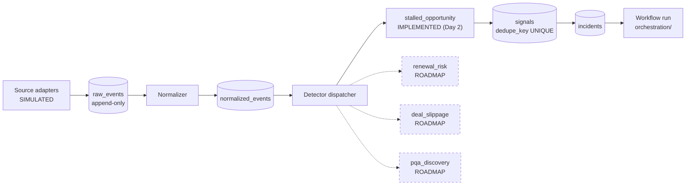
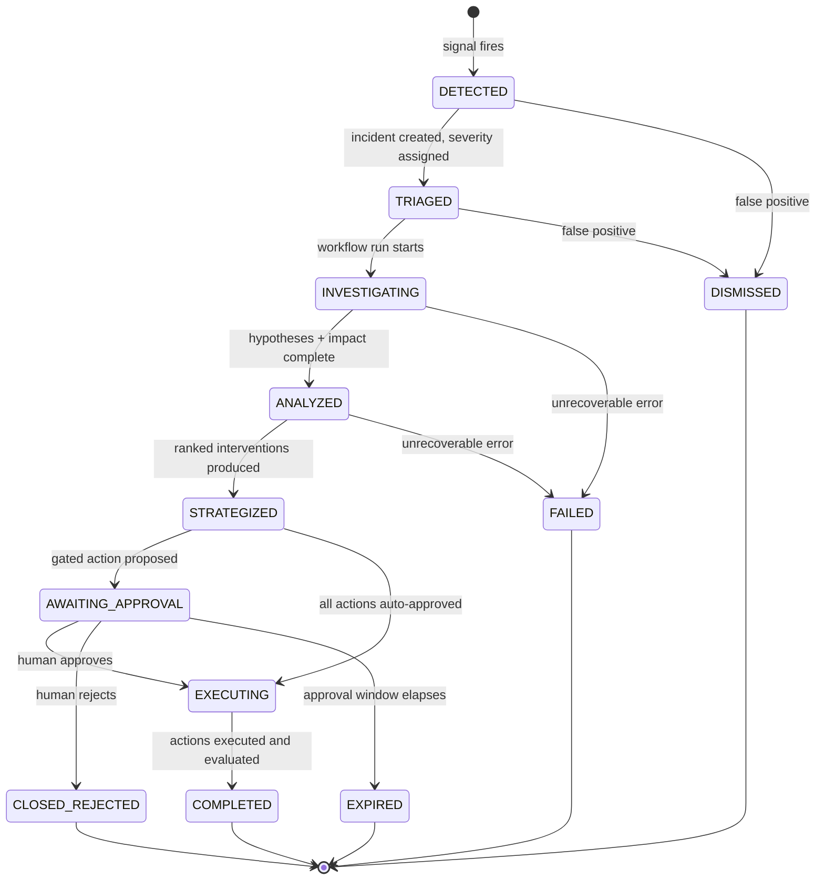

# Event Model

**Status:** AUTHORITATIVE
**Last updated:** 2026-08-01 (Phase 1)

Events are the input to the system; incidents are the unit of work. This document defines
the canonical envelope, the detector contract, and the incident lifecycle.

---

## 1. Transport decision

There is **no message broker in v1**. Events are rows in PostgreSQL and processing is
driven by an in-process dispatcher plus an outbox table. This is a deliberate choice
recorded in ADR-0006: at demo scale a broker adds operational surface without adding
capability, and rule 17 says don't install unnecessary infrastructure.

The `EventEnvelope` and the dispatcher interface are shaped so that swapping the substrate
for Kafka or SQS later changes `events/` only.

---

## 2. Pipeline



Ingestion is **replay-safe**: `raw_events` is uniquely keyed on
`(source_system, source_event_id)`, so re-running ingestion produces no duplicates.

---

## 3. Canonical event envelope

Every normalized event conforms to this Pydantic model regardless of source.

| Field | Type | Notes |
|---|---|---|
| `event_id` | `UUID` | Assigned at normalization |
| `schema_version` | `str` | `"1.0"` — bumped on breaking envelope change |
| `event_type` | `EventType` | Enum, see below |
| `source_system` | `SourceSystem` | `crm` / `product` / `engagement` / `support` / `enrichment` |
| `occurred_at` | `datetime` | UTC, from the source |
| `received_at` | `datetime` | UTC, ours |
| `account_ref` | `str \| None` | Business key, e.g. `ACC-1001` |
| `opportunity_ref` | `str \| None` | Business key, e.g. `OPP-2001` |
| `attributes` | `dict[str, JSONValue]` | Typed per `event_type` at the detector boundary |
| `trust_level` | `Literal["untrusted"]` | **Always untrusted.** Source content is adversarial by assumption (rule 14). |

`trust_level` is a constant, not a variable. There is no code path that marks ingested
GTM content as trusted.

### Event types in v1

| `event_type` | Source | Used by |
|---|---|---|
| `crm.opportunity.updated` | crm | stalled_opportunity |
| `crm.activity.logged` | crm | stalled_opportunity |
| `product.usage.rollup` | product | stalled_opportunity |
| `engagement.email.activity` | engagement | evidence only |
| `engagement.meeting.held` | engagement | evidence only |
| `support.issue.opened` | support | evidence only |

Declared but not emitted in v1 (contracts for future scenarios):
`crm.opportunity.stage_changed`, `crm.record.quality_flagged`,
`enrichment.provider.usage_reported`, `campaign.performance.rollup`.

---

## 4. Detector contract

```
Detector:
    signal_type: str
    version: str
    window: timedelta
    def evaluate(context: DetectionContext) -> Signal | None
```

Detectors are **pure and deterministic** — same inputs, same output, always. They take a
`DetectionContext` (a read-only bundle of the relevant normalized events and mirrored
source rows) and return a `Signal` or nothing. No I/O, no LLM, no clock access except the
`evaluated_at` passed in.

That last point matters: passing the evaluation time in rather than calling `now()` is
what makes the detector unit-testable and the demo reproducible.

### `stalled_opportunity` — the only detector implemented in v1

| Parameter | Value | Rationale |
|---|---|---|
| `min_amount` | 100,000 USD | "High-value" threshold |
| `inactivity_days` | 14 | Days since the most recent sales activity |
| `usage_growth_pct` | 40% | Week-over-week growth in `feature_events` |
| `open_stages` | `Discovery`, `Proposal`, `Negotiation` | Excludes closed opportunities |

Fires when **all** conditions hold. The conjunction is the point: rising usage plus sales
silence is a far stronger signal than either alone, and it is exactly the pattern a human
rep misses.

`dedupe_key = sha256(signal_type | opportunity_ref | detector_version | window_start)`

### Registered-but-unimplemented detectors

These exist as registry entries with declared parameters and no implementation. They
appear in the capability matrix as ROADMAP and in the dashboard's integration catalog as
"contract defined".

`renewal_risk` · `deal_slippage` · `pqa_discovery` · `account_expansion` ·
`crm_data_quality` · `enrichment_cost_anomaly` · `campaign_underperformance`

---

## 5. Incident lifecycle



| State | Meaning | Terminal |
|---|---|---|
| `DETECTED` | Signal fired, incident opened, not yet triaged | No |
| `TRIAGED` | Severity and ownership assigned | No |
| `INVESTIGATING` | Workflow running: plan, evidence, hypotheses | No |
| `ANALYZED` | Hypotheses and deterministic impact complete | No |
| `STRATEGIZED` | Ranked interventions produced, policy evaluated | No |
| `AWAITING_APPROVAL` | Blocked on a human decision (graph interrupted) | No |
| `EXECUTING` | Authorized actions being performed | No |
| `COMPLETED` | Actions executed, outcome evaluated | **Yes** |
| `CLOSED_REJECTED` | Human rejected the proposed action | **Yes** |
| `EXPIRED` | Approval window elapsed with no decision | **Yes** |
| `DISMISSED` | Judged a false positive | **Yes** |
| `FAILED` | Unrecoverable error; state preserved for inspection | **Yes** |

**Every transition is persisted** to `workflow_transitions` before the next node runs, with
the originating node, the edge predicate that fired, and a state digest. Rule 13 is
satisfied by construction: there is no way to move the workflow without leaving a record.

---

## 6. Idempotency boundaries

Four independent layers, each at a different granularity:

| Layer | Mechanism | Prevents |
|---|---|---|
| Ingestion | `UNIQUE (source_system, source_event_id)` on `raw_events` | Duplicate raw events |
| Detection | `UNIQUE (dedupe_key)` on `signals` | A second incident for the same condition |
| Workflow | Checkpoint + `UNIQUE (run_id, sequence)` on transitions | Re-executing a completed node on resume |
| Action | `UNIQUE (idempotency_key)` on `action_records` | The same CRM task or email draft twice |

`idempotency_key = sha256(run_id | intervention_ref | action_type | target_ref)`

The key deliberately includes `run_id`: re-running the *same* incident's workflow must not
duplicate actions, while a genuinely new incident on the same opportunity is free to act.

---

## 7. Outbox pattern

Side effects are not performed inline with the transaction that decides them. The
executor writes an `action_records` row and an outbox entry in one transaction, then a
dispatcher performs the effect and records the result. If the process dies between the two,
the effect is retried on restart and the `idempotency_key` guarantees it happens once.

Retries use bounded exponential backoff with a maximum attempt count recorded in
`action_records.attempt_count`. Exhausted retries mark the action `FAILED` and emit an
audit event — they never silently drop.

---

## Related documents

- [`data-model.md`](data-model.md) · [`agent-architecture.md`](agent-architecture.md) · [`security-model.md`](security-model.md) · [`demo-scenario.md`](demo-scenario.md)
- ADR [`0006`](architecture-decisions/0006-postgres-as-event-substrate.md)
