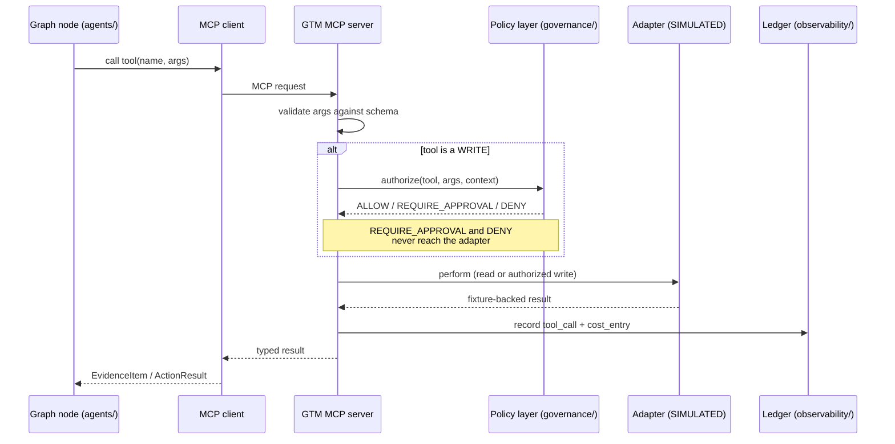

# GTM MCP Server Design

**Status:** AUTHORITATIVE
**Last updated:** 2026-08-01 (Phase 1)

The custom **GTM MCP server** is the only way any part of Revenue Sentinel touches an
external system. It exposes 15 narrow, typed tools. There is no `run_sql`, no
`http_request`, and no generic escape hatch — that is the whole design (rule 15).

> All tools are backed by **SIMULATED** adapters in v1.

---

## 1. Why narrow tools

A broad tool is a broad blast radius. `run_sql(query)` cannot be policy-gated
meaningfully, cannot be risk-tiered, cannot be idempotent, and cannot be audited in terms
a human reviewer understands. `crm_create_task(opportunity_ref, title, due_date)` can be
all four.

| Property | Broad tool | Narrow tool |
|---|---|---|
| Argument validation | Impossible in general | Full JSON Schema |
| Risk tiering | One tier for everything | Per-tool tier |
| Idempotency | Undefined | Deterministic key from typed args |
| Audit legibility | "ran a query" | "created task X on OPP-2001" |
| Injection blast radius | Unbounded | Bounded by the tool's own contract |

---

## 2. Tool flow



The critical property: **a write tool cannot reach its adapter without a policy decision**.
This is enforced in the server, not left to the caller's discipline.

---

## 3. Tool catalog

`R` = read-only, `W` = write. Tier per [`security-model.md`](security-model.md).

### Read tools — Tier 0, always permitted

| Tool | Args | Returns | Source |
|---|---|---|---|
| `crm_search_accounts` | `query`, `segment?`, `limit≤50` | `AccountSummary[]` | crm |
| `crm_get_account` | `account_ref` | `Account` | crm |
| `crm_get_opportunity` | `opportunity_ref` | `Opportunity` | crm |
| `crm_list_account_activities` | `account_ref`, `since`, `limit≤200` | `Activity[]` | crm |
| `product_get_usage_summary` | `account_ref`, `period_start`, `period_end` | `UsageSummary` | product |
| `engagement_get_email_activity` | `account_ref`, `since` | `EngagementEvent[]` | engagement |
| `engagement_get_meeting_activity` | `account_ref`, `since` | `EngagementEvent[]` | engagement |
| `support_get_open_issues` | `account_ref` | `SupportIssue[]` | support |
| `enrichment_get_company_profile` | `account_ref` | `CompanyProfile` | enrichment |

### Write tools — policy-gated

| Tool | Args | Tier | Gate |
|---|---|---|---|
| `crm_create_task` | `opportunity_ref`, `title`, `description`, `due_date`, `assignee_ref` | **1** | Auto-approved — internal, reversible, no customer contact |
| `crm_update_opportunity` | `opportunity_ref`, `field`, `value`, `reason` | **2** | Human approval — material CRM change |
| `messaging_create_email_draft` | `account_ref`, `recipient_ref`, `subject`, `body`, `intent` | **2** | Human approval — customer-facing |
| `messaging_send_slack_approval` | `channel_ref`, `incident_ref`, `summary` | **1** | Auto-approved — internal notification only |

### Computation and audit

| Tool | Args | Tier | Notes |
|---|---|---|---|
| `analytics_calculate_pipeline_impact` | `opportunity_ref`, `signal_type`, `factors` | **0** | **Pure deterministic call into `analytics/`.** Exposed as a tool so the LLM can request the calculation without ever performing it. |
| `audit_write_event` | `incident_ref`, `event_type`, `payload` | **0** | Append-only audit write |

`analytics_calculate_pipeline_impact` is the enforcement point for rule 9. The Revenue
Analyst agent cannot compute impact itself; it can only ask for the computation. The
number that appears in the dashboard comes from tested Python, and the tool boundary is
what guarantees it.

**There is deliberately no `messaging_send_email` tool in v1.** Sending is Tier 3 —
not permitted at all. The system can only create a draft. Capability we do not need is
capability we do not build.

---

## 4. Schema, validation, and errors

Every tool declares a JSON Schema with `additionalProperties: false` and explicit
`required`. Arguments are validated twice — once by the MCP server against the schema, once
by a Pydantic model inside the handler. The second pass is not redundant: it enforces
business constraints a schema cannot express (`since` must be in the past, `limit` must
respect the caller's remaining budget).

Errors are typed and returned as MCP tool errors, never raised as opaque exceptions:

| Error | Meaning | Agent's expected response |
|---|---|---|
| `INVALID_ARGUMENTS` | Schema or business validation failed | Correct and retry once |
| `NOT_FOUND` | Referenced entity does not exist | Record as negative evidence; do not retry |
| `POLICY_DENIED` | Policy layer refused | Stop; do not attempt an alternative route |
| `APPROVAL_REQUIRED` | Gated write; approval request created | Halt the graph at the interrupt |
| `RATE_LIMITED` | Adapter throttle | Retry with backoff |
| `BUDGET_EXCEEDED` | Cost Governor refused | Halt the run |
| `ADAPTER_ERROR` | Simulated upstream failure | Retry with backoff, then fail the node |

`POLICY_DENIED` explicitly instructs the agent *not* to route around the refusal. An agent
that responds to a denial by trying a different tool is the failure mode this whole layer
exists to prevent.

---

## 5. Transport and testing

| Context | Transport | Why |
|---|---|---|
| Demo and production shape | **stdio MCP server** subprocess | The real, spec-compliant thing — this is what makes it an MCP server rather than a function registry |
| Tests and evaluation | **In-process MCP client** | No subprocess, no flake, fast enough to run on every commit |

Both paths execute the identical handler code. The transport is swapped, not the logic.

---

## 6. Adapters and the honesty boundary

```
mcp/tools/crm.py            → integrations/ports/crm.py     (Protocol)
                            → integrations/simulated/crm.py (fixture-backed)
                            → integrations/hubspot/crm.py   (ROADMAP — does not exist)
```

Each simulated adapter module carries a required header comment and a module-level
constant:

```python
INTEGRATION_STATUS = "SIMULATED"
```

The MCP server reads `INTEGRATION_STATUS` from the bound adapter and includes it in every
tool result envelope. The dashboard renders it as a badge. There is no configuration that
makes a simulated adapter claim to be real (rule 5).

Each adapter's docstring must also contain a **"What changes when this becomes real"**
section naming the specific API, the auth model, the rate limits, and the fields that
would differ. That section is what turns "it's mocked" from an excuse into a design
document.

---

## 7. Tool-call ledger

Every invocation writes a `tool_calls` row: run, node, tool name, arguments, result digest,
status, duration, and the trace/span IDs. Combined with `model_calls`, this is the complete
record of everything the system did and everything it asked. See
[`cost-governance.md`](cost-governance.md).

---

## Related documents

- [`security-model.md`](security-model.md) · [`agent-architecture.md`](agent-architecture.md) · [`cost-governance.md`](cost-governance.md)
- ADR [`0004`](architecture-decisions/0004-simulated-integrations.md), [`0005`](architecture-decisions/0005-policy-and-approval-model.md)
