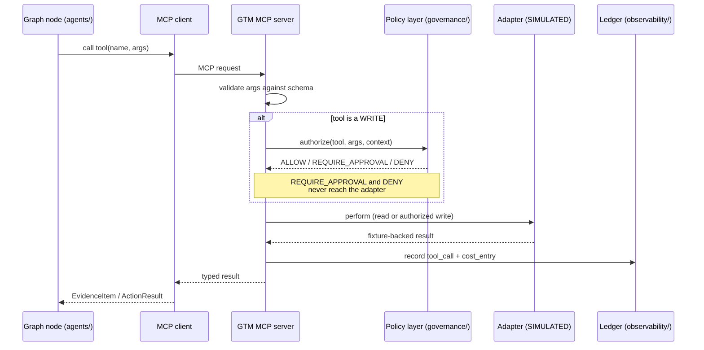

# GTM MCP Server Design

**Status:** AUTHORITATIVE
**Last updated:** 2026-08-05 (Session 4 — built)

The custom **GTM MCP server** is the only way any part of Revenue Sentinel touches an
external system. It exposes 15 narrow, typed tools. There is no `run_sql`, no
`http_request`, and no generic escape hatch — that is the whole design (rule 15).

> All tools are backed by **SIMULATED** adapters in v1.

> **As of Session 4 this document describes code that exists.** All 15 tools are
> implemented. Both transports — in-process and stdio — are IMPLEMENTED and verified.
> `McpEvidenceSource` is what the investigation graph uses; evidence gathering no longer
> touches repositories directly. Every adapter is SIMULATED and every tool result says so.
> The four write tools are **registered but not wired into the graph**, and no write has
> ever been executed. See §8 for the exact state of each claim.

---

## 1. Why narrow tools

A broad tool is a broad blast radius. `run_sql(query)` cannot be policy-gated
meaningfully, cannot be risk-tiered, cannot be idempotent, and cannot be audited in terms
a human reviewer understands. `crm_create_task(opportunity_ref, title, due_date)` can be
all four.

| Property | Broad tool | Narrow tool |
|---|---|---|
| Argument validation | Impossible in general | Full JSON Schema |
| Risk tiering | One tier for everything | Per-tool tier |
| Idempotency | Undefined | Deterministic key from typed args |
| Audit legibility | "ran a query" | "created task X on OPP-2001" |
| Injection blast radius | Unbounded | Bounded by the tool's own contract |

---

## 2. Tool flow



The critical property: **a write tool cannot reach its adapter without a policy decision**.
This is enforced in the server, not left to the caller's discipline.

---

## 3. Tool catalog

`R` = read-only, `W` = write. Tier per [`security-model.md`](security-model.md).

### Read tools — Tier 0, always permitted

| Tool | Args | Returns | Source |
|---|---|---|---|
| `crm_search_accounts` | `query`, `segment?`, `limit≤50` | `AccountSummary[]` | crm |
| `crm_get_account` | `account_ref` | `Account` | crm |
| `crm_get_opportunity` | `opportunity_ref` | `Opportunity` | crm |
| `crm_list_account_activities` | `account_ref`, `since`, `limit≤200` | `Activity[]` | crm |
| `product_get_usage_summary` | `account_ref`, `period_start`, `period_end` | `UsageSummary` | product |
| `engagement_get_email_activity` | `account_ref`, `since` | `EngagementEvent[]` | engagement |
| `engagement_get_meeting_activity` | `account_ref`, `since` | `EngagementEvent[]` | engagement |
| `support_get_open_issues` | `account_ref` | `SupportIssue[]` | support |
| `enrichment_get_company_profile` | `account_ref` | `CompanyProfile` | enrichment |

### Write tools — policy-gated

| Tool | Args | Tier | Gate |
|---|---|---|---|
| `crm_create_task` | `opportunity_ref`, `title`, `description`, `due_date`, `assignee_ref` | **1** | Auto-approved — internal, reversible, no customer contact |
| `crm_update_opportunity` | `opportunity_ref`, `field`, `value`, `reason` | **2** | Human approval — material CRM change |
| `messaging_create_email_draft` | `account_ref`, `recipient_ref`, `subject`, `body`, `intent` | **2** | Human approval — customer-facing |
| `messaging_send_slack_approval` | `channel_ref`, `incident_ref`, `summary` | **1** | Auto-approved — internal notification only |

### Computation and audit

| Tool | Args | Tier | Notes |
|---|---|---|---|
| `analytics_calculate_pipeline_impact` | `opportunity_ref`, `signal_type`, `factors` | **0** | **Pure deterministic call into `analytics/`.** Exposed as a tool so the LLM can request the calculation without ever performing it. |
| `audit_write_event` | `incident_ref`, `event_type`, `payload` | **0** | Append-only audit write |

`analytics_calculate_pipeline_impact` is the enforcement point for rule 9. The Revenue
Analyst agent cannot compute impact itself; it can only ask for the computation. The
number that appears in the dashboard comes from tested Python, and the tool boundary is
what guarantees it.

**There is deliberately no `messaging_send_email` tool in v1.** Sending is Tier 3 —
not permitted at all. The system can only create a draft. Capability we do not need is
capability we do not build.

---

## 4. Schema, validation, and errors

Every tool declares a JSON Schema with `additionalProperties: false` and explicit
`required`. Arguments are validated twice — once by the MCP server against the schema, once
by a Pydantic model inside the handler. The second pass is not redundant: it enforces
business constraints a schema cannot express (`since` must be in the past, `limit` must
respect the caller's remaining budget).

Errors are typed and returned as MCP tool errors, never raised as opaque exceptions:

| Error | Meaning | Agent's expected response |
|---|---|---|
| `INVALID_ARGUMENTS` | Schema or business validation failed | Correct and retry once |
| `NOT_FOUND` | Referenced entity does not exist | Record as negative evidence; do not retry |
| `POLICY_DENIED` | Policy layer refused | Stop; do not attempt an alternative route |
| `APPROVAL_REQUIRED` | Gated write; approval request created | Halt the graph at the interrupt |
| `RATE_LIMITED` | Adapter throttle | Retry with backoff |
| `BUDGET_EXCEEDED` | Cost Governor refused | Halt the run |
| `ADAPTER_ERROR` | Simulated upstream failure | Retry with backoff, then fail the node |

`POLICY_DENIED` explicitly instructs the agent *not* to route around the refusal. An agent
that responds to a denial by trying a different tool is the failure mode this whole layer
exists to prevent. In code this is `ERROR_POLICY[POLICY_DENIED]` carrying
`retry=False, alternative_route=False`, asserted by a test rather than left to the prose
above.

> **`BUDGET_EXCEEDED` is defined but has no producer.** The error code, its policy entry,
> and its tests exist; nothing raises it, because the Cost Governor that would is Session 7
> work. It is listed here as a contract, not as a behaviour. A reader who expects a budget
> refusal today will not get one.

---

## 5. Transport and testing

| Context | Transport | Status | Why |
|---|---|---|---|
| Demo and production shape | **stdio MCP server** subprocess | **IMPLEMENTED** | The real, spec-compliant thing — this is what makes it an MCP server rather than a function registry |
| Graph, tests, and evaluation | **In-process MCP client** | **IMPLEMENTED** | No subprocess, no flake, fast enough to run on every commit |

Both paths execute the identical handler code. The transport is swapped, not the logic.

**Parity is structural before it is tested.** The stdio server's `tools/call` handler and
`InProcessMcpClient.call_tool` both delegate to **`dispatcher.dispatch`** with the same
`ToolContext`. Validation, the policy gate, the adapter call, the envelope, and the ledger
row happen in exactly one place. There is no second implementation that could drift, so the
parity tests confirm the wiring rather than policing two copies of the logic.

### The stdio proof

`make mcp` runs `python -m scripts.mcp_server`.
`tests/integration/test_transport_parity.py` launches that same module as a **real
subprocess** over real pipes and asserts:

| Checked over the wire | Result |
|---|---|
| MCP initialization handshake | ✅ server `revenue-sentinel-gtm`, protocol `2025-11-25` |
| `tools/list` | ✅ 15 tools |
| `additionalProperties: false` on every schema **as the client receives it** | ✅ all 15 |
| No `messaging_send_email` advertised | ✅ absent |
| Successful read (`crm_get_account`, `crm_get_opportunity`, `support_get_open_issues`) | ✅ payloads byte-identical to the in-process client |
| `integration_status` survives the transport | ✅ `"SIMULATED"` |
| Missing entity | ✅ typed `NOT_FOUND`, `is_error: true`, `retry: false` |
| Unknown argument | ✅ typed `INVALID_ARGUMENTS` — strictness is *enforced* by the server, not merely advertised |

Because the subprocess is a separate process with its own connection, it sees only
**committed** data — so that module seeds and cleans up its own scenario rather than
relying on the rolled-back transaction the rest of the suite uses.

> **One gap, stated plainly.** There is no stdio test for "a write attempted with no policy
> engine bound is refused". The stdio server binds `policy=None` deliberately, so such a
> call *does* raise rather than execute — but the client-visible shape of that refusal was
> not verified, and asserting an unverified shape would be worse than not asserting it. The
> guarantee itself is proven four ways in-process against the same dispatcher: a missing
> engine raises, a denied write never reaches its adapter (checked with a spy), and
> `POLICY_DENIED` forbids both retry and rerouting. Pinning the wire shape is Session 5
> work, alongside the real policy engine.

### The async boundary

MCP is asynchronous; this system is not ([ADR-0009](architecture-decisions/0009-synchronous-persistence.md)).
Async is confined to `mcp/client.py`, which owns a persistent `asyncio.Runner`, and to the
`asyncio.run()` line in `scripts/mcp_server.py`. Agents, LangGraph nodes, repositories, and
application services stay synchronous. `InProcessMcpClient` touches no event loop at all.
See [ADR-0014](architecture-decisions/0014-sync-async-mcp-boundary.md).

---

## 6. Adapters and the honesty boundary

```
mcp/tools/crm.py            → integrations/ports/crm.py     (Protocol)
                            → integrations/simulated/crm.py (fixture-backed)
                            → integrations/hubspot/crm.py   (ROADMAP — does not exist)
```

Each simulated adapter module carries a required header comment and a module-level
constant:

```python
INTEGRATION_STATUS = "SIMULATED"
```

The MCP server reads `INTEGRATION_STATUS` from the bound adapter and includes it in every
tool result envelope. The dashboard renders it as a badge. There is no configuration that
makes a simulated adapter claim to be real (rule 5).

Each adapter's docstring must also contain a **"What changes when this becomes real"**
section naming the specific API, the auth model, the rate limits, and the fields that
would differ. That section is what turns "it's mocked" from an excuse into a design
document.

**As built:** all six adapters (crm, product, engagement, support, enrichment, messaging)
declare `INTEGRATION_STATUS: Final = SIMULATED` and carry that section. `integrations/status.py`
resolves the constant and **raises `MissingIntegrationStatusError` when a module does not
declare one** — there is no default, so a new adapter cannot arrive unlabelled. Every tool
result envelope carries `integration_status: "SIMULATED"`, and it survives both transports.

Simulated latency and failure injection are deterministic and **inert by default**:
`SimulatedBehaviour` does nothing unless configured, and failures come from an explicit
script (`crm_get_account:3=ADAPTER_ERROR`) rather than randomness. A demo cannot flake by
accident, and a failure test cannot pass by luck.

`MessagingPort` has **no send method**. The Tier 3 capability is absent from the interface,
not merely unrouted — see §3.

---

## 7. Tool-call ledger

Every invocation writes a `tool_calls` row: run, node, tool name, arguments, result digest,
status, duration, and the trace/span IDs. Combined with `model_calls`, this is the complete
record of everything the system did and everything it asked. See
[`cost-governance.md`](cost-governance.md).

**IMPLEMENTED in Session 4.** A row is written for success, for a typed error, and for a
policy denial — a refusal is a recorded event, not a silence. One `make investigate` run
produces 5 rows sharing 1 trace ID with 5 distinct span IDs.

---

## 8. What Session 4 actually built — and what it did not

**Built and verified**

| Claim | State |
|---|---|
| All 15 tools implemented, strict schemas | ✅ `additionalProperties: false` asserted per tool, in-process and over the wire |
| In-process transport | ✅ IMPLEMENTED — what the graph and the suite use |
| stdio transport | ✅ IMPLEMENTED — real subprocess, handshake, JSON-RPC (§5) |
| Both transports share `dispatcher.dispatch` | ✅ structural, plus a payload-equality test |
| Every integration SIMULATED | ✅ six adapters, undeclared status raises |
| Every result stamped `integration_status` | ✅ `"SIMULATED"`, survives stdio |
| Write tools require a policy decision | ✅ 4 write tools; no engine bound → raises |
| Denied writes never reach the adapter | ✅ verified with a spy adapter |
| Tool-call ledger | ✅ success, error, and denial all recorded |
| `McpEvidenceSource` used by `run_investigation` | ✅ the graph no longer reads repositories |
| Evidence parity | ✅ **byte-equivalent** to the legacy source; fixture digests unchanged |

**Deliberately not built**

| Not built | Why |
|---|---|
| Real vendor integrations | Rule 5. Every adapter is SIMULATED and says so |
| Real policy engine | Session 5. `StubPolicyEngine` exists but **was never used to demonstrate a write** |
| Approval flow | Session 5 |
| **Write execution from the graph** | The 4 write tools are registered but **unwired**. `run_investigation` binds `policy=None`, so a write reached from the graph would raise rather than execute — the graph cannot write even by accident, and certainly not under an allow-everything stub |
| `BUDGET_EXCEEDED` producer | Session 7 (§4) |
| `messaging_send_email` | Tier 3 — not a capability, and absent from `MessagingPort` |
| Retry engine, cost governance, frontend | Sessions 6, 7, 9 |

**The evidence source swap, precisely**

`RepositoryEvidenceSource` is **legacy** and survives only as the control in
`tests/integration/test_evidence_parity.py`. It carries a real, documented contract defect:
**`get_email_activity` conflates meetings with email activity** — it counts *all*
engagement events, including `meeting_held`. The MCP contract is correct: it separates
`engagement_get_email_activity` from `engagement_get_meeting_activity`.

The difference **does not surface for `ACC-1001`** — the golden account has no meetings in
the window — which is why byte-equivalent parity holds and why the golden scenario is
unaffected. The defect is recorded here and in the module docstring rather than papered
over, and the repository source is not the reference shape.

No real credentials, no external integration, no paid API call, and no live LLM call
occurred. **Session 4 spent $0.**

---

## Related documents

- [`security-model.md`](security-model.md) · [`agent-architecture.md`](agent-architecture.md) · [`cost-governance.md`](cost-governance.md)
- ADR [`0004`](architecture-decisions/0004-simulated-integrations.md), [`0005`](architecture-decisions/0005-policy-and-approval-model.md), [`0014`](architecture-decisions/0014-sync-async-mcp-boundary.md)
