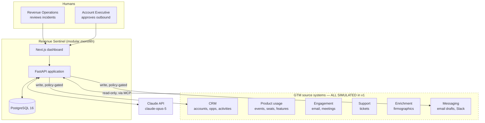
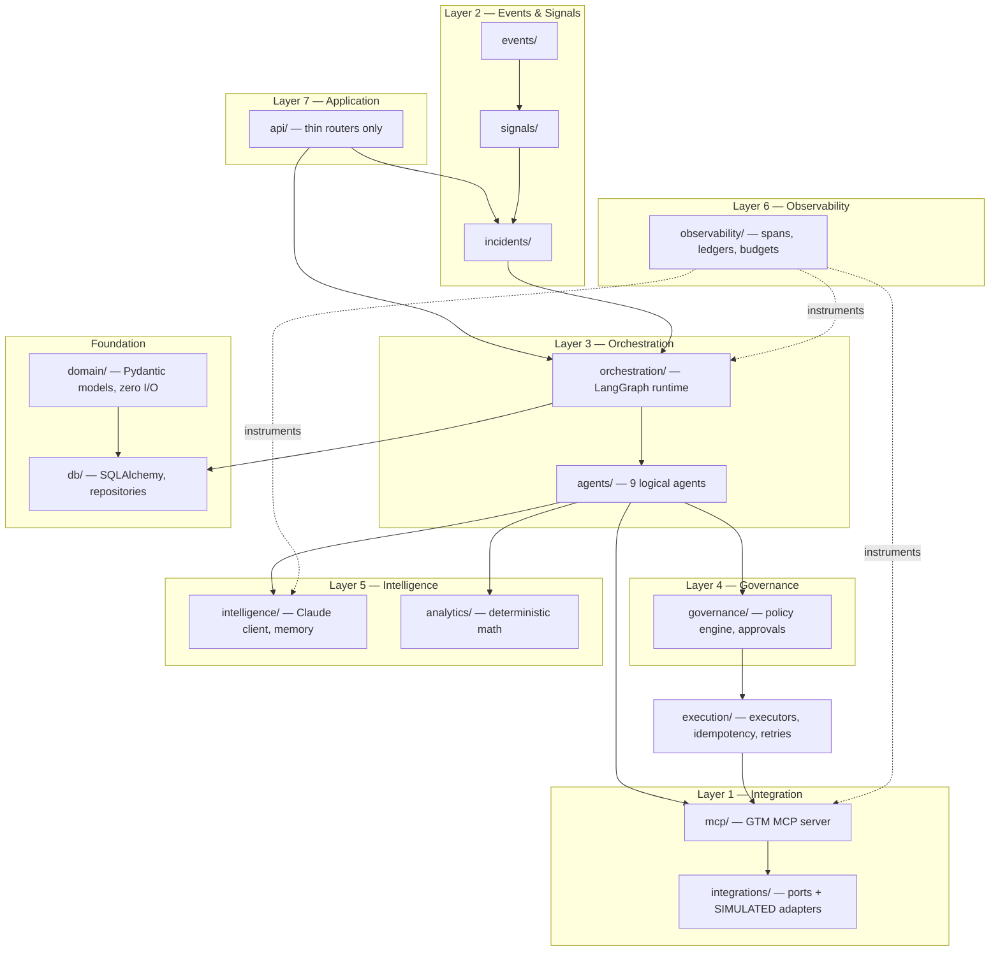
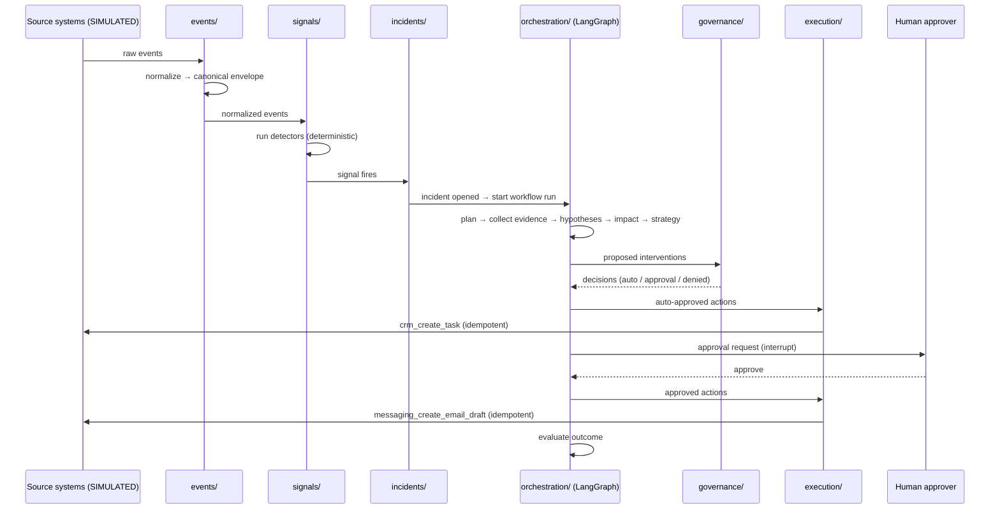
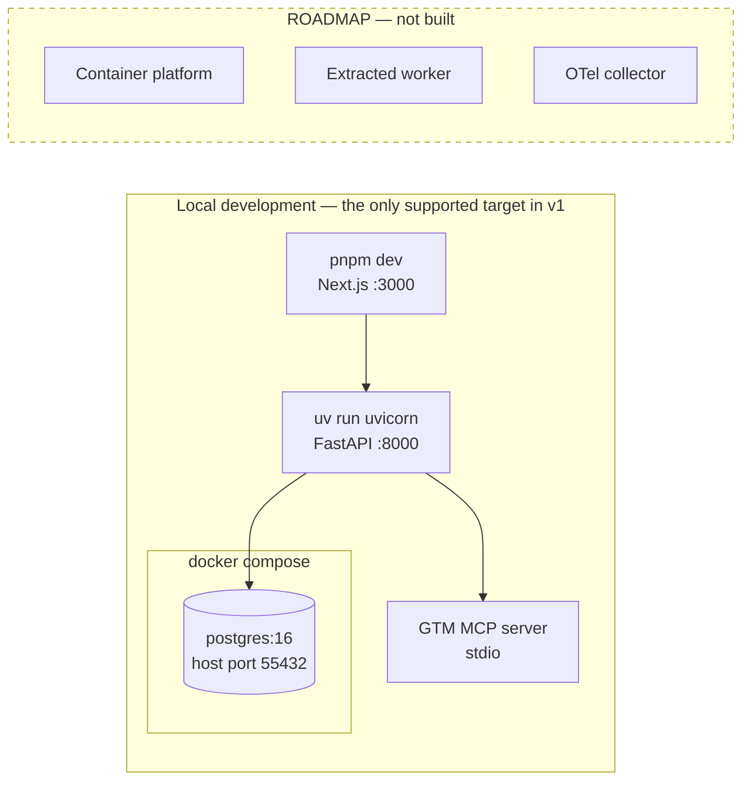
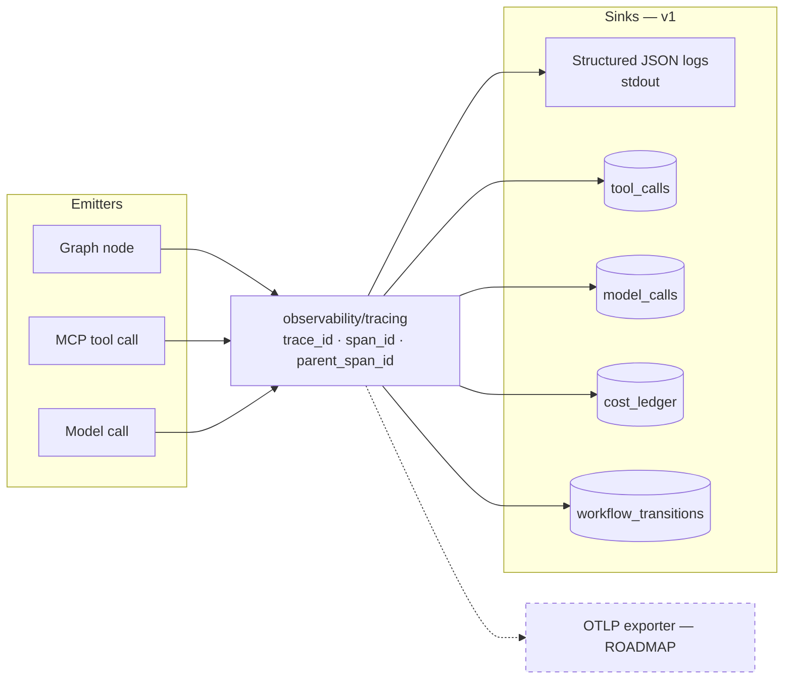

# System Architecture

**Status:** AUTHORITATIVE — this document and `agent-architecture.md` define the layer boundaries all code must respect.
**Last updated:** 2026-08-01 (Phase 1)

Revenue Sentinel is an **Agentic AI GTM Control Tower**. It detects revenue leakage and
growth opportunities across go-to-market systems, investigates each finding with
specialized agents, quantifies business impact with deterministic code, recommends
ranked interventions, enforces policy, obtains human approval for sensitive actions,
executes approved workflows idempotently, tracks cost, and evaluates its own behaviour.

> **Integration status:** every external system in this document is **SIMULATED** by a
> deterministic local adapter. No real CRM, email, Slack, or enrichment provider is
> connected. See [`../CAPABILITY_MATRIX.md`](../CAPABILITY_MATRIX.md).

---

## 1. System context

The dashed boundary is the honesty line: everything inside it is a fixture-backed adapter
in v1. The port interfaces are real; the implementations behind them are not.

---

## 2. The eight layers

Each platform layer maps to exactly one Python package. This 1:1 mapping is deliberate —
it makes the architecture diagram and the directory listing the same artifact.

| # | Layer | Package | Responsibility |
|---|---|---|---|
| 1 | Integration & MCP | `integrations/`, `mcp/` | Ports for external systems; simulated adapters; the custom GTM MCP server exposing 15 narrow tools |
| 2 | Event & Signal | `events/`, `signals/` | Ingest raw events, normalize to a canonical envelope, run detectors, emit signals, open incidents |
| 3 | Agent Orchestration | `orchestration/`, `agents/` | LangGraph state machine; nine logical agents as typed nodes; checkpointing and resume |
| 4 | Governance & Approval | `governance/` | Deterministic policy engine, risk tiers, approval requests, decision records |
| 5 | Intelligence & Memory | `intelligence/`, `analytics/` | LLM client with structured output; memory/retrieval; **deterministic calculators** |
| 6 | Cost & Observability | `observability/` | OTel-shaped spans, tool-call ledger, model-call ledger, cost ledger, budgets |
| 7 | Application & Dashboard | `api/`, `apps/web/` | Thin FastAPI routers; Next.js dashboard |
| 8 | Evaluation & Security | `evaluation/` | Rubric harness, scenario assertions, injection-defence tests |

---

## 3. Modular monolith

### Enforced import rules

Checked in CI by `import-linter`; a violation fails the build.

| Rule | Statement |
|---|---|
| R1 | `domain/` imports nothing from `db/`, `api/`, `integrations/`, `mcp/`, or any I/O module. |
| R2 | `api/` may import services and domain models; it may not import `db/` session internals, `intelligence/`, or `mcp/` directly. |
| R3 | `analytics/` may not import `intelligence/`. **Calculators can never reach an LLM.** |
| R4 | `execution/` may only perform side effects through `mcp/`, and only when handed a `PolicyDecision`. |
| R5 | `agents/` may not import `db/` — state is passed in and deltas are returned. |
| R6 | Nothing imports `evaluation/` except tests and the eval CLI. |

Rule R3 is the one worth defending in an interview: it makes "no LLM arithmetic"
a property the build checks, not a promise in a README.

---

## 4. Request and workflow flow

---

## 4a. HTTP surface

**Status: this is the complete list as of Session 2.** Anything not in this table
does not exist. The route surface is pinned by a test, so an undocumented endpoint
appearing is a build failure rather than a discovery.

| Method | Path | Purpose | Session |
|---|---|---|---|
| `GET` | `/health` | Liveness and database reachability. `503` when the database is unreachable. | 1 |
| `POST` | `/ingest` | Run one ingestion cycle over the **SIMULATED** source feed: sources → raw events → normalized events → detectors → signals → incidents. | 2 |
| `GET` | `/incidents` | The incident queue. Optional `status`, `severity`, and `limit` filters. | 2 |
| `GET` | `/incidents/{incident_ref}` | One incident with its account, opportunity, and the signal that produced it. `404` if unknown. | 2 |

Routers are thin (boundary R2): parse, delegate, serialize. `POST /ingest` calls
`events/pipeline.py`, which is importable and tested without an HTTP server.

**`POST /ingest` is replay-safe, not idempotent-in-response.** The first call opens
incidents and the second reports zero, because the underlying constraints refuse
duplicates at three levels. The response reports both what was created and what was
deduplicated, since that distinction is the design rather than an implementation
detail.

Every response carrying GTM data exposes `is_simulated`, and every ingestion response
carries `ingestion_status: "SIMULATED"`. The dashboard renders its badges from those
fields rather than from hardcoded strings, so rule 5 is a property of the payload.

Arriving later: `POST /incidents/{ref}/approve` and `/reject` (Session 6),
`GET /incidents/{ref}/timeline` (Session 7).

---

## 5. Deployment design

**Frontend (Session 9).** `apps/web` is Next.js 16 + React 19 + TypeScript. The API
contract is **generated** from FastAPI's OpenAPI schema into `apps/web/generated`
(ADR-0023), so a backend field rename breaks the frontend build rather than rendering an
empty cell. Fetching lives in one typed client layer (`apps/web/lib/api.ts`); components
do not call `fetch`. The runtime is offline — no CDN fonts, analytics, or remote assets —
and a test verifies that against the *built output* rather than the source.

v1 is deliberately small: one API process, one database, one frontend. No broker, no
cache, no collector.

**Port 55432 is deliberate.** The developer machine runs a Homebrew PostgreSQL 16 on
5432; binding the container there would silently connect the app to the wrong database.

---

## 6. Observability flow

OpenTelemetry-**compatible** by design, not OTel-**instrumented** in v1: we emit spans
with OTel-shaped fields into structured JSON logs and our own tables. Swapping in a real
exporter is a change in `observability/` only.

Every record carries `incident_id`, `run_id`, `trace_id`, and `span_id`, so the incident
timeline in the dashboard is a database query, not a log scrape.

---

## 7. What is explicitly out of scope for v1

| Excluded | Why | Status |
|---|---|---|
| Message broker (Kafka/Redis/Celery) | A Postgres table plus an outbox pattern is honest at this scale | ROADMAP |
| Vector database / pgvector | The slice retrieves ~6 evidence records; a `WHERE` clause suffices | ROADMAP |
| OTel collector, Jaeger | Spans are emitted OTel-shaped; no infra needed to prove the design | ROADMAP |
| Authentication, multi-tenancy | Single-tenant demo; adds surface with no interview value here | ROADMAP |
| Multiple deployable services | Modular monolith first; boundaries are drawn for later extraction | ROADMAP |

See [`scaling-roadmap.md`](scaling-roadmap.md) for the extraction path.

---

## Related documents

- [`agent-architecture.md`](agent-architecture.md) — the nine agents and the LangGraph state machine
- [`data-model.md`](data-model.md) — entities and the ERD
- [`event-model.md`](event-model.md) — event envelope and incident lifecycle
- [`mcp-design.md`](mcp-design.md) — the 15 GTM MCP tools
- [`security-model.md`](security-model.md) — trust boundaries and approval flow
- [`cost-governance.md`](cost-governance.md) — budgets, routing, ledger
- ADR [`0001`](architecture-decisions/0001-modular-monolith.md), [`0002`](architecture-decisions/0002-langgraph-orchestration-boundary.md), [`0006`](architecture-decisions/0006-postgres-as-event-substrate.md)
